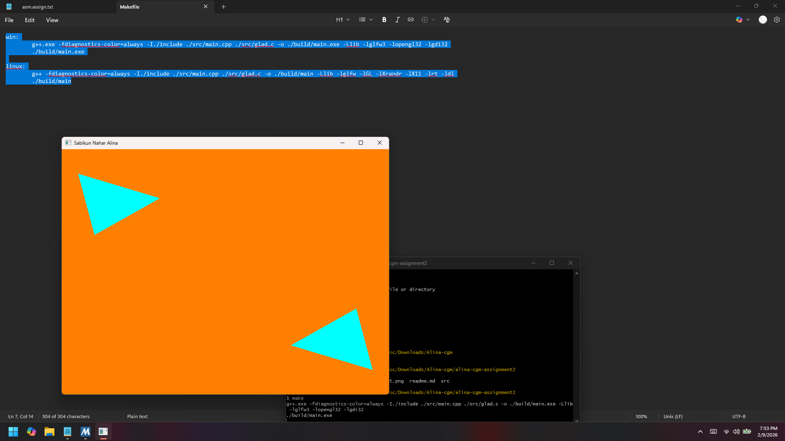

Here is a clean, **course-appropriate `README.md`** you can directly use in your GitHub repository:

---

# 🧪 Lab 02: OpenGL Window & Triangle Rendering

## 📘 Course Information

* **Course**: CSE 358 – Computer Graphics and Multimedia
* **Semester**: Spring 2026
* **Lab No**: 02

---

## 📌 Student Information

* **Student Name**: Sabikun Nahar Alina
* **Student ID**: 0432320005101016
* **Section**: 5B2

---

## 📋 Assignment Description

The objective of this lab is to familiarize students with basic OpenGL window creation and rendering using **GLFW** and **GLAD**.
The program creates an OpenGL window with a **cyan-colored shape** rendered on an **orange background** and displays the **student’s full name as the window title**.

### Functional Requirements:

* Create an OpenGL window using GLFW
* Set the window title to the student's full name
* Render two cyan-colored obtuse triangles
* Handle keyboard input to close the window
* Properly manage OpenGL shaders, buffers, and callbacks

---

## 🛠️ Technologies Used

* **C++**
* **OpenGL 3.3 Core Profile**
* **GLFW** (Window & Input Management)
* **GLAD** (OpenGL Function Loader)

---

## 🎨 Program Features

* 🪟 Window size: **800 × 600**
* 🟧 Background color: **Orange**
* 🔺 Two **cyan obtuse triangles** rendered at opposite corners
* 🏷️ Window title displays: **“Sabikun Nahar Alina”**
* ⌨️ Press **`S`** to close the window
* 🔄 Viewport auto-adjusts on window resize

---

## 🧾 Code Overview

* **Vertex Shader**: Handles vertex positioning
* **Fragment Shader**: Outputs cyan color
* **VAO & VBO**: Store and manage vertex data
* **Render Loop**: Clears the screen and draws triangles continuously
* **Callbacks**:

  * `framebuffer_size_callback()` for resizing
  * `processInput()` for keyboard handling

---

## ▶️ Code Output

The following image shows the program output after successful execution:

---

## 🚀 How to Run

1. Ensure **GLFW** and **GLAD** are properly installed
2. Compile using a C++ compiler (e.g., `g++`)
3. Link OpenGL and GLFW libraries
4. Run the executable
5. Press **S** to close the window

---

## ✅ Conclusion

This lab demonstrates the fundamentals of OpenGL programming, including window creation, shader compilation, vertex buffer management, and real-time rendering. It provides a solid foundation for understanding how graphical objects are rendered and controlled using modern OpenGL.

