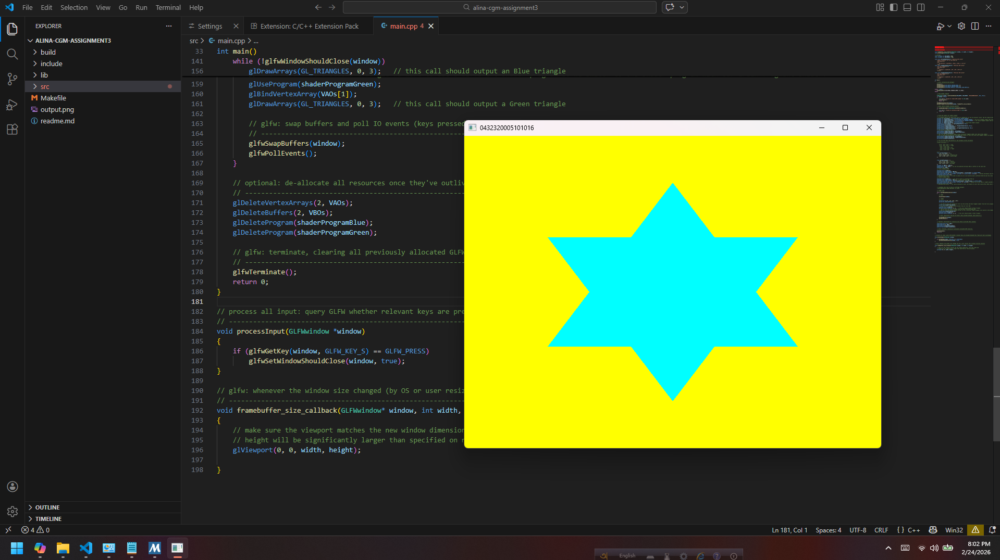

# Lab Assignment 3 – OpenGL Cyan Star with Yellow Background

**Student Name:** Sabikun Nahar Alina  
**Student ID:** 0432320005101016  
**Semester:** 6th  
**Course:** Computer Graphics  
**Instructor:** Any Chowdhury  
**Due:** 25 FEB 2026
**Points:** 10

---

## Overview

This program uses OpenGL (with GLFW and GLAD) to render a **cyan-colored six-pointed star** built entirely from triangles, displayed against a **yellow background**. The window title is set to the student's full ID, and pressing the name's initial letter closes the window.

---

## What the Program Does

- Renders a yellow background (`glClearColor(1.0f, 1.0f, 0.0f, 1.0f)`)
- Draws a star shape composed of **triangles only** using two VAOs/VBOs
  - **Triangle 1:** Points upward (top vertex + bottom-left + bottom-right)
  - **Triangle 2:** Points downward (bottom vertex + top-left + top-right)
  - Together they form a Star of David / hexagram shape
- Both triangles are colored **cyan** (`vec4(0.0f, 1.0f, 1.0f, 1.0f)`)
- Window title is set to the student's **full ID** (e.g., `0432320005101016`)
- Pressing **`S`** (the initial letter of the student's name) closes the window

---

## Controls

| Key | Action           |
|-----|------------------|
| `S` | Close the window |

---

## Project Structure

```
lab3/
├── main.cpp       # Main source file
├── glad.h         # GLAD OpenGL loader header
├── glad.c         # GLAD implementation
├── glfw3.h        # GLFW header
└── README.md      # This file
```

---

## How to Build and Run

### Prerequisites

- OpenGL 3.3+ compatible GPU and drivers
- GLFW3 library installed
- GLAD loader (included)
- A C++ compiler (g++, clang++, or MSVC)

### Linux / macOS

```bash
g++ main.cpp glad.c -o lab3 -lglfw -lGL -ldl -lpthread
./lab3
```

### Windows (MinGW)

```bash
g++ main.cpp glad.c -o lab3.exe -lglfw3 -lopengl32 -lgdi32
lab3.exe
```

---

## Implementation Details

### Two Shader Programs

- `shaderProgramBlue` — used to draw the first (upward-pointing) triangle
- `shaderProgramGreen` — used to draw the second (downward-pointing) triangle
- Both fragment shaders output **cyan** (`vec4(0.0, 1.0, 1.0, 1.0)`)

### Triangle Vertices

**First Triangle (upward):**
```
Top:          ( 0.0,  0.7, 0.0)
Bottom Left:  (-0.6, -0.35, 0.0)
Bottom Right: ( 0.6, -0.35, 0.0)
```

**Second Triangle (downward):**
```
Bottom:    ( 0.0, -0.7, 0.0)
Top Left:  (-0.6,  0.35, 0.0)
Top Right: ( 0.6,  0.35, 0.0)
```

### Key OpenGL Concepts Used

- Vertex Array Objects (VAOs) and Vertex Buffer Objects (VBOs)
- Vertex and Fragment Shaders (GLSL 330 core)
- Multiple shader programs
- `glDrawArrays` with `GL_TRIANGLES`
- Framebuffer size callback for responsive resizing

---

## Expected Output

A window titled with the student's full ID displaying:
- A **yellow** background
- A **cyan star** (hexagram) centered on screen, formed by two overlapping triangles

---

## Notes

- Window can be resized; the viewport updates automatically via `framebuffer_size_callback`
- The program follows the render loop pattern: clear → draw → swap buffers → poll events
- All GPU resources (VAOs, VBOs, shader programs) are properly deleted on exit

---

## Screenshot

> **How to add your screenshot:**
> 1. Run the program and take a screenshot (Windows: `Win + Shift + S` or Snipping Tool; Linux: `scrot` or `gnome-screenshot`)
> 2. Save it as `output.png` inside a `screenshots/` folder in your project directory
> 3. The image will render below automatically once added


